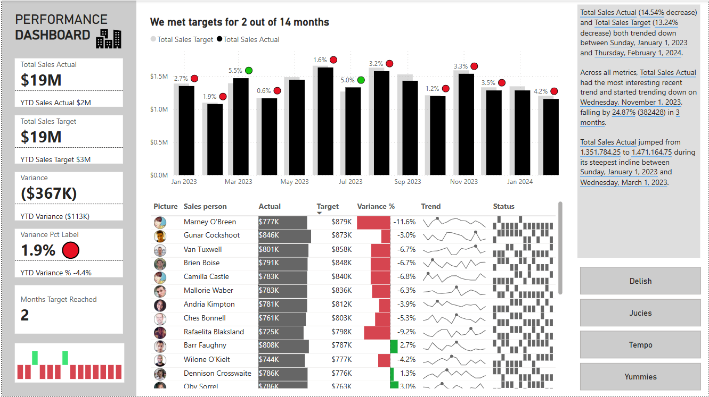

# 📊 Finance KPI Dashboard

## 🚀 Overview
This **Finance KPI Dashboard** is built using **Power BI** to provide actionable insights into financial performance. It tracks key metrics, identifies trends, and enables data-driven decision-making.

## 📌 Features
- **Total Sales Performance** – Compare actual vs. target metrics
- **Variance Analysis** – Identify performance gaps and trends
- **Salesperson Breakdown** – Individual performance tracking
- **Trend Visualization** – Spot key shifts in sales over time
- **Interactive UI** – Dynamic filtering and drill-down capabilities

## 🔄 Workflow
1️⃣ **Data Preparation** – Connected & transformed data using **Power Query**  
2️⃣ **Data Modeling** – Built a robust **semantic model** with table relationships  
3️⃣ **Calculations** – Performed financial calculations using **DAX**  
4️⃣ **Dashboard Visuals & Interactions** – Created engaging & interactive reports  

## 📂 Files
- `Dashboard.pbix` – Power BI dashboard file
- `Dataset.xlsx` – Sample dataset used for visualization
- `README.md` – Documentation for this project

## 🛠️ Tools & Technologies
- **Power BI** – Data visualization & dashboard creation
- **Power Query** – Data transformation
- **DAX (Data Analysis Expressions)** – Advanced calculations

## 📸 Preview

## 📈 Insights & Use Cases
- Track sales performance trends over time
- Identify variance between actual & target sales
- Monitor individual salesperson contributions
- Analyze revenue gaps for better forecasting
